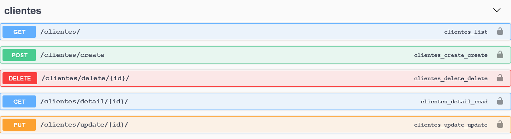

# cadastro-api

[](https://pyup.io/repos/github/heltonteixeira92/cadastro-api/)
[](https://pyup.io/repos/github/heltonteixeira92/cadastro-api/)


# To run this application

##Console:

```python -m venv .venv```

```.venv\acripts\activate```

``pip install -r requirements.txt``

``cp contrib/env-sample .env``

`` python manage.py makemigrations``

```python manage.py migrate```

``python manage.py runserver``

## Endpoints
- 127.0.0.1:8000/swagger/
